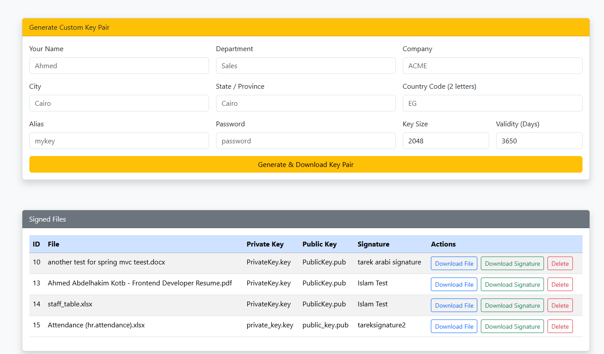

# 📁 File Signer App

A Spring Boot application to sign and verify files using RSA encryption.  
It supports file upload, signature verification, and RSA key pair generation – all from a clean web interface.

## 🔒 File Upload & Signing


## ✅ Signature Verification


---

## 📄 Project Overview

**File Signer App** is a web-based tool that allows users to:

- ✅ Upload a file and digitally sign it using an RSA private key  
- ✅ Verify if a file matches its signature using the public key  
- ✅ Generate RSA public/private key pairs  
- ✅ View, download, and delete signed files  

---

## 🚀 Features

- **File Signing** – Secure digital signing with SHA256withRSA
- **Signature Verification** – Validates uploaded files and signatures
- **Key Generation** – RSA 2048-bit key pair zipped and downloaded
- **History Management** – See uploaded/signed files with download and delete options
- **Modern UI** – Thymeleaf + Bootstrap for responsive design
- **Toast Alerts** – Dynamic success/error messages via Flash Attributes

---

## ⚙️ Technologies Used

| Layer         | Technology             |
|--------------|------------------------|
| Backend       | Spring Boot (Java 17+) |
| Frontend      | Thymeleaf, Bootstrap 5 |
| Database      | MySQL or H2 (JDBC)     |
| Build Tool    | Maven                  |

---

## 🛠️ Setup Instructions

### 1. Clone the Project

```bash
git clone https://github.com/your-username/file-signer-app.git
cd file-signer-app

This app uses MySQL. Run the SQL below to set up the required schema and table.

🗃️ SQL Script
-- Create the database
CREATE DATABASE file_signer_db;

-- Use the database
USE file_signer_db;

-- Create the table
CREATE TABLE sign_process (
    id BIGINT PRIMARY KEY AUTO_INCREMENT,
    file_name VARCHAR(255),
    private_key_name VARCHAR(255),
    public_key_name VARCHAR(255),
    sign_name VARCHAR(255),
    file_data BLOB,
    private_key_data BLOB,
    public_key_data BLOB,
    signature BLOB
);

